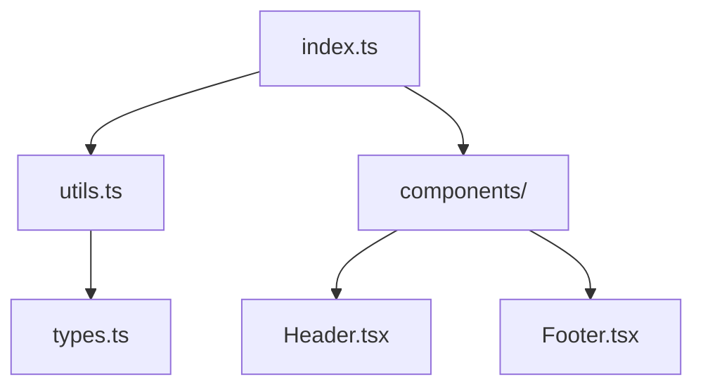

# Skill: Codebase Reading and Map 💻🧭

## Purpose
Build a code map for learning: scan file tree, parse dependencies, summarize functions/classes. Help students understand code structure.

## When to Use
- User uploads code project (zip, folder)
- User asks "explain this codebase" or "what does this code do?"
- User wants "code map" or "dependency graph"

## Input Contract
- `fileId`: string (required, must be code file or project)
- `language`: string (optional, auto-detect if not provided)
- `includeTests`: boolean (optional, default: false)
- `maxDepth`: number (optional, default: 3 for folder depth)

## Workflow

### Step 1: Scan file tree
- List all files recursively (up to maxDepth)
- Detect language by extension (.js, .py, .java, etc)
- Ignore common excludes: node_modules, .git, build, dist

### Step 2: Parse imports/dependencies
For each code file:
- Extract import statements
- Build dependency graph: file A imports B, C
- Detect circular dependencies (warn)

**Example (JavaScript/TypeScript)**:
```typescript
import { foo } from './utils'
import React from 'react'
→ Dependencies: ['./utils', 'react']
```

**Example (Python)**:
```python
import numpy as np
from mymodule import helper
→ Dependencies: ['numpy', 'mymodule']
```

### Step 3: Extract code structure
For each file:
- Parse functions, classes, interfaces
- Extract docstrings/comments
- Count lines of code

**Example output per file**:
```json
{
  "file": "src/utils.ts",
  "language": "typescript",
  "loc": 120,
  "functions": [
    {"name": "calculateSum", "line": 5, "params": ["a", "b"], "doc": "Adds two numbers"}
  ],
  "classes": [
    {"name": "Calculator", "line": 20, "methods": ["add", "subtract"]}
  ],
  "imports": ["lodash", "./types"]
}
```

### Step 4: Identify entry points
- Look for main files: `index.js`, `main.py`, `App.tsx`
- Look for exported functions (public API)
- Rank by "importance" (number of imports)

### Step 5: Generate summary
Use LLM to summarize codebase:
```typescript
const prompt = `Analyze this codebase structure and generate a summary:
Files: ${fileList}
Dependencies: ${depGraph}
Entry points: ${entryPoints}

Generate:
1. Overall purpose (1-2 sentences)
2. Key modules (3-5)
3. Architecture pattern (MVC, microservices, etc)
4. Tech stack
`
const summary = await callGemini(prompt)
```

### Step 6: Build visual map (Mermaid graph)
Generate dependency graph:


## Output Contract
Must include:
- `fileTree`: array of file paths
- `dependencies`: dependency graph
- `entryPoints`: array of main files
- `summary`: text summary
- `diagram`: Mermaid code (optional)

```json
{
  "fileTree": ["src/index.ts", "src/utils.ts", ...],
  "totalFiles": 25,
  "totalLOC": 3500,
  "languages": ["typescript", "css"],
  "dependencies": {
    "src/index.ts": ["./utils", "react"],
    "src/utils.ts": ["lodash"]
  },
  "entryPoints": ["src/index.ts", "src/App.tsx"],
  "keyModules": [
    {"name": "utils", "purpose": "Helper functions"},
    {"name": "components", "purpose": "React UI components"}
  ],
  "summary": "This is a React web app using TypeScript...",
  "diagram": "graph TD\n  A[index.ts] --> B[utils.ts]..."
}
```

## Atomic Tools Used
- `fileIO.scanDirectory(path, maxDepth)`
- `extract.detectLanguage(filename)`
- `extract.parseImports(content, language)`
- `extract.parseFunctions(content, language)`
- `extract.parseClasses(content, language)`
- `transform.buildDependencyGraph(imports)`
- `transform.generateMermaidGraph(depGraph)`
- `render.mermaidToSvg(mermaidCode)` (for visualization)

## Verification Rules
- At least 1 entry point identified
- Dependency graph has no orphan nodes
- Summary < 200 words
- Diagram renderable (valid Mermaid syntax)

## Error Handling
- If language not supported → return file list only
- If parsing fails → fallback to regex-based extraction
- If too many files (>100) → sample or ask user to select subset

## Estimated Tokens
~3500 tokens (structure analysis + summary generation)

## Example Usage
**User**: Uploads `my_react_app.zip`
**Output**:
```json
{
  "totalFiles": 18,
  "totalLOC": 2100,
  "languages": ["typescript", "tsx", "css"],
  "entryPoints": ["src/index.tsx", "src/App.tsx"],
  "keyModules": [
    {"name": "components", "purpose": "UI components"},
    {"name": "utils", "purpose": "Helper functions"},
    {"name": "types", "purpose": "TypeScript interfaces"}
  ],
  "summary": "A React TypeScript web application with 3 main modules...",
  "diagram": "graph TD\n  A[index.tsx] --> B[App.tsx]..."
}
```

User can see visual map + clickable nodes to explore each file
